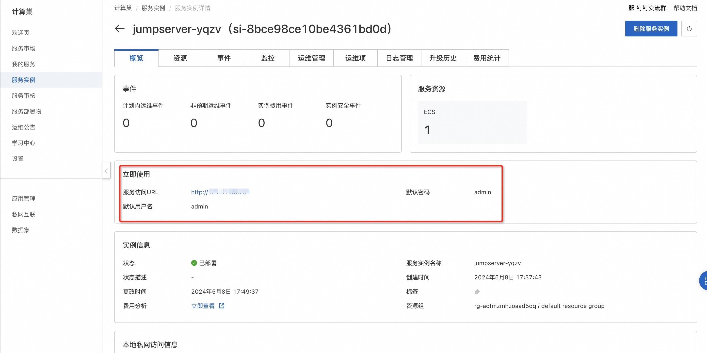
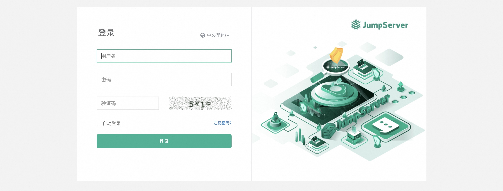

# JumpServer社区版服务实例部署文档

## 概述

JumpServer 是广受欢迎的开源堡垒机，是符合 4A 规范的专业运维安全审计系统。JumpServer 帮助企业以更安全的方式管控和登录所有类型的资产，实现事前授权、事中监察、事后审计，满足等保合规要求。

## 计费说明

计费方式包括：
- 按量付费（小时）
- 包年包月

预估费用在创建实例时可实时看到。

## RAM账号所需权限
JumpServer服务需要对ECS、VPC等资源进行访问和创建操作，
若您使用RAM用户创建服务实例，需要在创建服务实例前，
对使用的RAM用户的账号[添加相应资源的权限](https://help.aliyun.com/document_detail/121945.html)。

| 权限策略名称 | 备注               |
| --- |------------------|
| AliyunECSFullAccess | 管理云服务器服务（ECS）的权限 |
| AliyunVPCFullAccess | 管理专有网络（VPC）的权限   |
| AliyunROSFullAccess | 管理资源编排服务（ROS）的权限 |
| AliyunComputeNestUserFullAccess | 管理计算巢服务（ComputeNest）的用户侧权限|
| AliyunCloudMonitorFullAccess | 管理云监控（CloudMonitor）的权限|

## 部署流程

### 部署步骤
单击[部署链接](https://computenest.console.aliyun.com/service/instance/create/cn-hangzhou?type=user&ServiceId=service-c5638ae27d34478fbb3d)，进入服务实例部署界面，根据界面提示，填写参数完成部署。

### 验证结果
1、查看服务实例。 服务实例创建成功后，部署时间大约需要2分钟。部署完成后，页面上可以看到对应的服务实例。

2、通过服务实例访问JumpServer服务

### 使用JumpServer

请访问JumpServer官网获取详细使用信息：[JumpServer试用文档](https://docs.jumpserver.org/zh/v3/)
